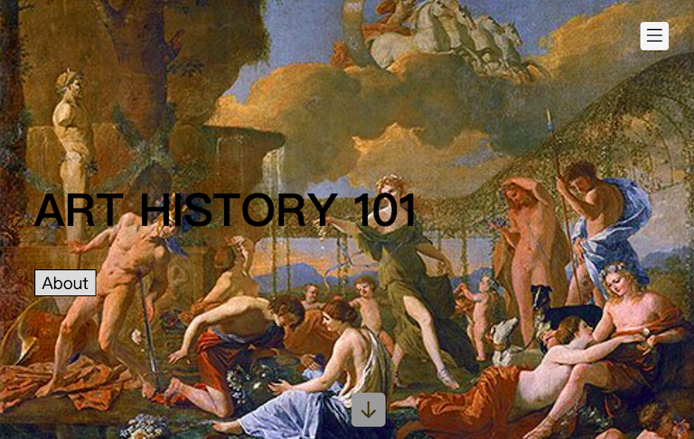

# Introduction

Because of the limitation of busy life, or the current closure of museums due to pandemic, contemporary people seem to get farther and farther away from art in lives.

Accordingly, our team hope to make a fun and stress-free mini-game. Through simple interaction, users can know some interesting stories behind art masterpieces, the public can maintain their passion for art in the gaps in life and understand some art history. 

Hope you enjoy it! :)

## Team Members

### Group 11

Masashi Asai: <zb20884@bristol.ac.uk>

Chun-Yu Chen: <hz20566@bristol.ac.uk>

Yu-Jen Yu: <yujen.yu.2020@bristol.ac.uk>

Zhengwu Song: <lu20732@bristol.ac.uk>

Lauren(Ya-Shiuan) Chian: <da20602@bristol.ac.uk>

## Prototyping

↓ click the photo below to watch video ↓

## Survey

We are collecting feedback from users now:
https://forms.gle/NnpbMXd8be3JNk9c6

## Background and Motivation
## System Implementation
## UX Design
## Sprints & Project Management
## Evaluation
## Conclusion
## Presentation

