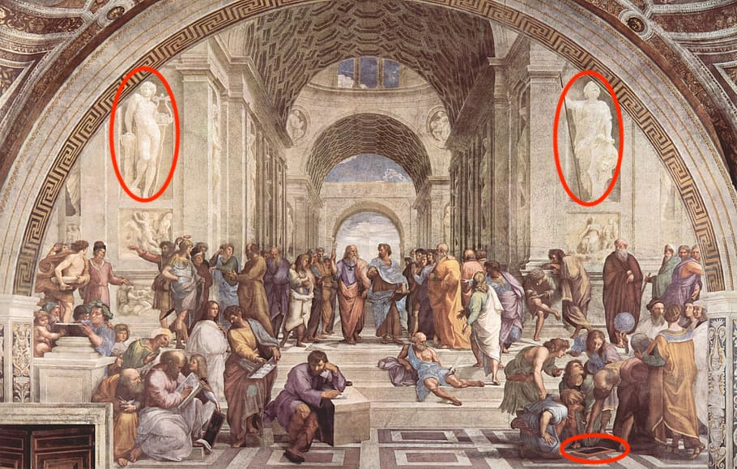
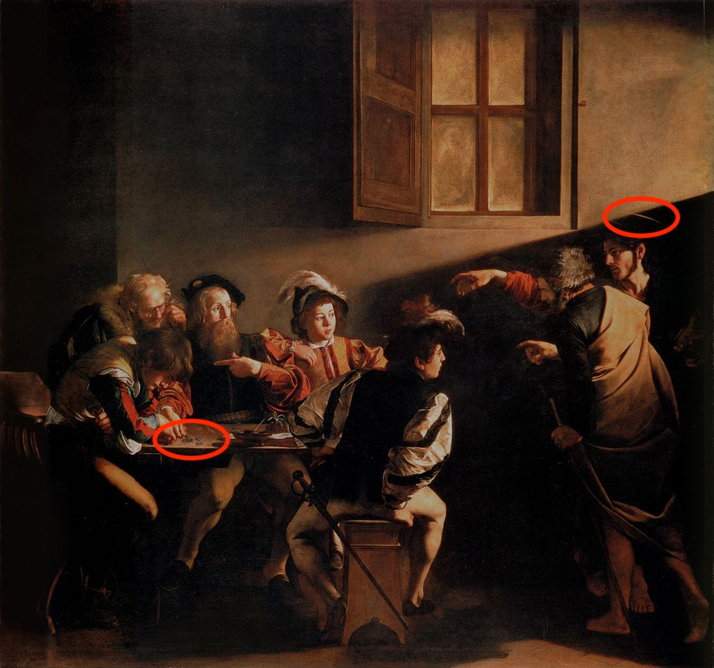
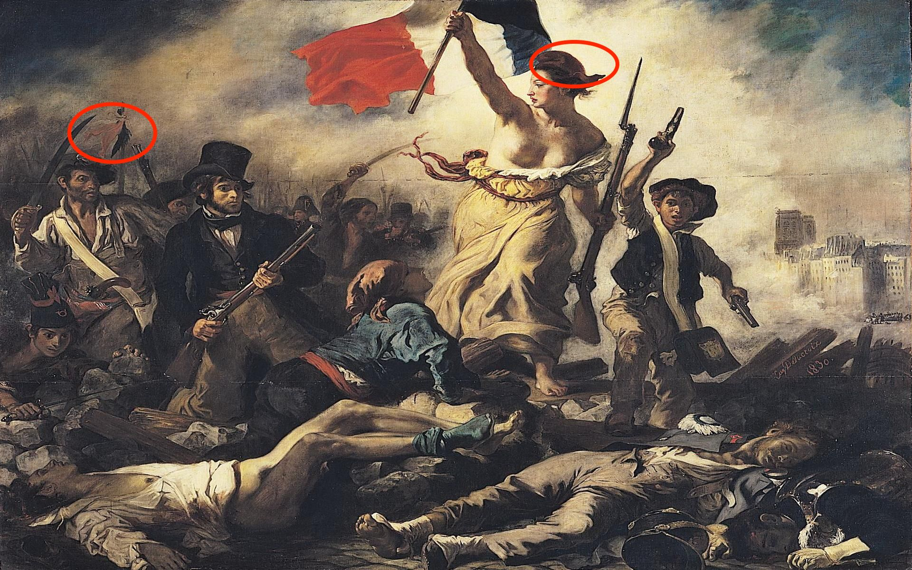
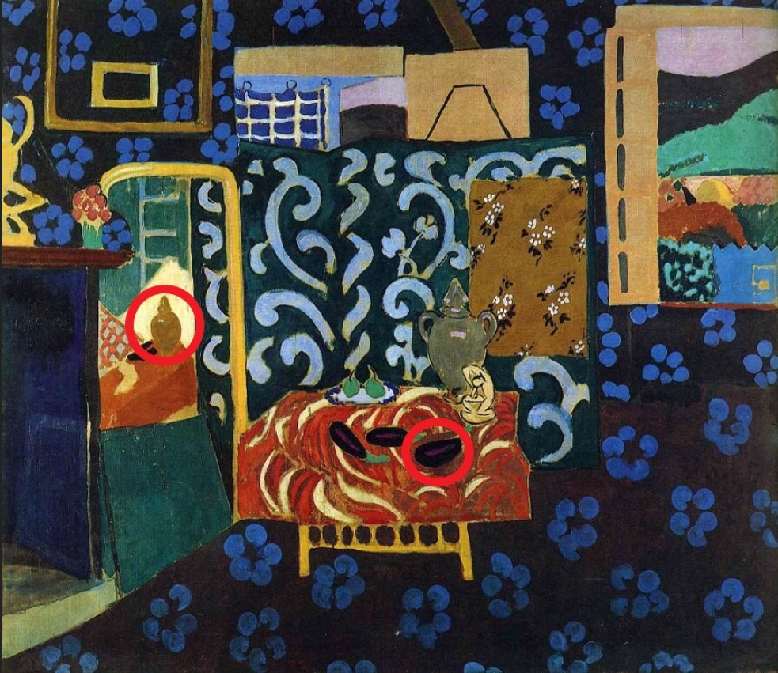
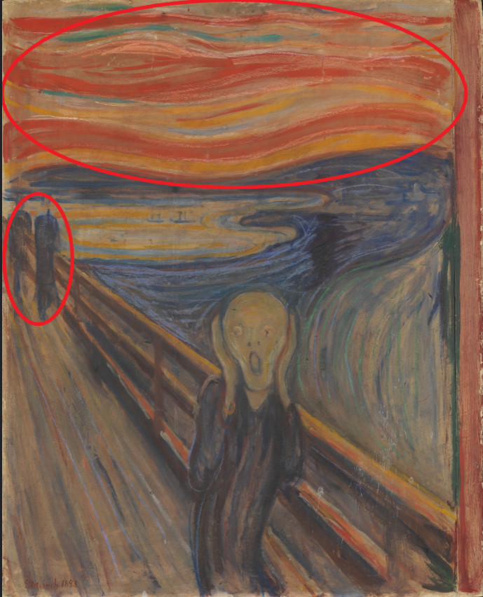

## Material for the Game: What's Wrong
### Renaissance
* Raffaello Sanzio
* [The School of Athens](https://en.wikipedia.org/wiki/The_School_of_Athens)

"School of Athens" is a large mural that the Pope ordered Raphael to paint in the Vatican palace, depicting intellectuals and hero from the ancient Greeks to the Renaissance.

1.780.125.The statue on the left is Apollo, the god of reason and harmony, who presides over the arts and entertainment, such as poetry and music.

2.1142.117.The statue on the right is a Minerva is a goddess of wisdom, warfare, and justice and an incarnation of studies.

3.1157.408.On the bottom right , the man pointing at a diagram on the ground is Euclid, a Greek mathematician. A man on the bottom left writing a book is Pitágoras, a Greek philosopher who emphasized the role of math and music. A man in the middle left wearing a helmet and armor is Alexander the Great, a king of the ancient Greek kingdom of Macedon.

### Baroque
* Michelangelo Merisi da Caravaggio
* [The Calling of St Matthew](https://en.wikipedia.org/wiki/The_Calling_of_St_Matthew_(Caravaggio))

"The Calling of St. Matthew" is the one of the master piece in Baroque art drawing a scene of "Gospel of Matthew" where St. Matthew is called by Jesus Christ.   

1.779.297.Though there is still some dispute as to who is Matthew in this painting, according to an influential view, a man in the left leaning on the desk is Matthew. This argument is based on the fact that there're coins in front of the man and Matthew was a working as a tax collector at that time.

2.1074.156.A man in right who is reaching out his right hand is Jesus. This is recognizable because he has a circle of halo on his head which is a traditional way of visually representing light from the body of a god. One of the remarkable aspects of this painting is that this backlighting is depicted only vaguely which is different from traditional religious arts which depict halo clearly. This shows Caravaggio's motivation for Realism.

### Romanticism
* Eugène Delacroix
* [Liberty Leading the People](https://en.wikipedia.org/wiki/Liberty_Leading_the_People)

"Liberty Leading the People" by Delacroix is about the French July Revolution in 1830.

1.87.121.A flag that Marianne is raising is the today's national flag of France and it is said to have originated from a symbol of French Revolution. There are some similar motifs in the painting which have that 3 colors. (e.g. a flag on the top left and a cloth of a woman in the center).

2.389.78.A woman depicted in the center is an imaginary character representing liberty and a symbol of France named "Marianne". In this painting Marianne is wearing a cap (Phrygian cap) which slaves in ancient Greece wear when they became freed and The motif is a good illustration of the concept of the work, liberation.

### Impressionism
* Olympia (Manet)
  
Olympia is a painting by Édouard Manet, which shows a nude woman ("Olympia") lying on a bed being brought flowers by a servant.

1.817.174.The black ribbon around Olympia's neck, in stark contrast with her pale flesh.

2.1247.282.Black cat is a creature associated with nocturnal promiscuity. The aroused posture of the cat was provocative; In French, chatte (cat) is slang for female genitalia.

### Post-Impressionism
* Paul Gauguin
* [Where Do We Come From? What Are We? Where Are We Going? (1898)](https://en.wikipedia.org/wiki/Where_Do_We_Come_From%3F_What_Are_We%3F_Where_Are_We_Going%3F)

Where do we come from? What are we? Where are we going? is a huge, brilliantly colored but enigmatic work painted on rough, heavy sackcloth. It contains numerous human, animal, and symbolic figures arranged across an island landscape. The sea and Tahiti’s volcanic mountains are visible in the background.

1.1007.109.The figure in the center is placed in a "Garden of Eden motif"; she is picking fruits from a tree. Gauguin intended to represent this woman as sin, like the allegory of Eve.

2.1193.335.A sleeping baby on the right represents the beginning of life. An old woman on the left is approaching death. Together, the painting from right to left suggests the cycle of "birth-sin-death".

### Fauvism
* Henri Matisse
* [Still Life with Aubergines](https://www.henrimatisse.org/still-life-with-aubergines.jsp)

The title of this picture is a monumental understatement, and one wonders if the artist used it ironically. It is, in terms of accessories and devices, one of the most complete presentations of his ongoing fundamental theme, the conversion of the artist's own studio into the idyllic world of Joy of Life.

1.767.218.A mirror at the left, partly obscured at the bottom by a drawing portfolio, reflects these and other objects on the table in an inconsistent fashion. It is as if Matisse is stating that the artist's mirror image of nature in a painting may take certain licenses with reality in the interests of the picture itself.

2.910.293.Three aubergines are balanced precariously on a table whose red cloth carries an undulating white pattern that reinforces their tuberous shape.

### Expressionism
* Edvard Munch
* [The Scream](https://en.wikipedia.org/wiki/The_Scream)

The artist stood there trembling with anxiety – and he sensed an infinite scream passing through nature.

1.688.193.The artist was walking along the road with two friends.

2.812.44.The sun was setting – suddenly the sky turned bloodily red.

### Cubism
* [THE LADIES OF AVIGNON](https://en.wikipedia.org/wiki/Les_Demoiselles_d%27Avignon)

The work  portrays five nude female prostitutes in a brothel on Carrer d'Avinyó, a street in Barcelona.

1.820.124.The two adjacent figures are shown in the Iberian style of Picasso's native Spain.

2.891.75.The two adjacent figures are shown in the Iberian style of Picasso's native Spain.

### Dadaism and Surrealism
* THE PERSISTENCE OF MEMORY
  
The picture appears to show the harbour of Right in the dawn. The landscape is concise: the sea appears in the depths, with small rocky formations on the right. The painting represents a dreamlike landscape, an expanded space where various objects are linked in an unsettled form. These watches, like memories, slowly soften with time. 

1.768.111.Only one melted watch hanging from the tree. 

2.805.297.On the table are two watches: a gold pocket watch covered in ants, and a melted watch.

### Abstract Expressionism
* NEW YORK CITY I
  
New York City I marks the beginning of a new phase in Mondrian's work. Lines in the primary colors - yellow, but also red and blue - traverse the square canvas, interweaving with each other.

1.745.101.It should be yellow. 

2.936.89.It should be yellow. 

3.1026.233.Missing of a yellow line.
