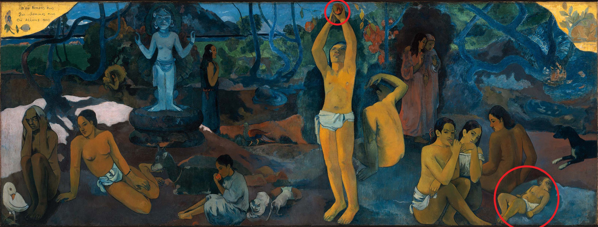
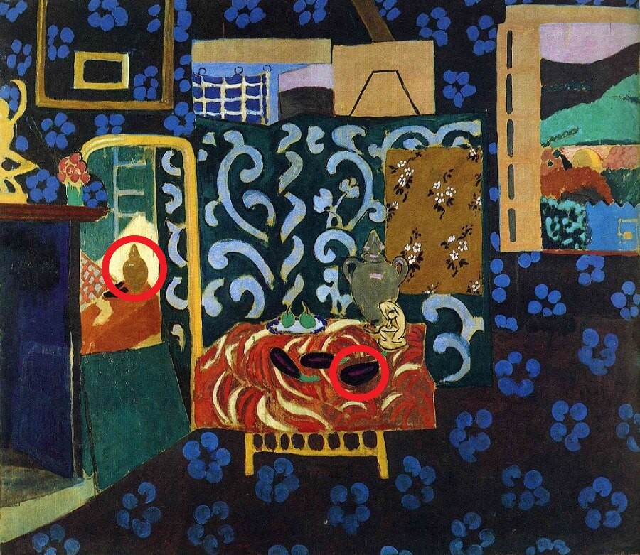

## Material for the Game: What's Wrong
### Post-Impressionism
* Paul Gauguin
* [Where Do We Come From? What Are We? Where Are We Going? (1898)](https://en.wikipedia.org/wiki/Where_Do_We_Come_From%3F_What_Are_We%3F_Where_Are_We_Going%3F)

1. A sleeping baby on the right represents the beginning of life. An old woman on the left is approaching death. Together, the painting from right to left suggests the cycle of "birth-sin-death". 
2. The figure in the center is placed in a "Garden of Eden motif"; she is picking fruits from a tree. Gauguin intended to represent this woman as sin, like the allegory of Eve.

### Fauvism
* Henri Matisse
* [Still Life with Aubergines](https://www.henrimatisse.org/still-life-with-aubergines.jsp)

1. A mirror at the left, partly obscured at the bottom by a drawing portfolio, reflects these and other objects on the table in an inconsistent fashion. It is as if Matisse is stating that the artist's mirror image of nature in a painting may take certain licenses with reality in the interests of the picture itself.
2. Three aubergines are balanced precariously on a table whose red cloth carries an undulating white pattern that reinforces their tuberous shape.

### Expressionism
* Edvard Munch
* [The Scream](https://en.wikipedia.org/wiki/The_Scream)

1. The artist was walking along the road with two friends – the sun was setting – suddenly the sky turned blood red – he paused, feeling exhausted, and leaned on the fence – there was blood and tongues of fire above the blue-black fjord and the city – his friends walked on, and he stood there trembling with anxiety – and he sensed an infinite scream passing through nature.

